# Automated LSEG Data Library For Python Jupyter Notebook Setup with GitHub Copilot

- Version: 1.0
- Last update: May 2026
- Environment: Python + Git + Copilot

## Copilot .github/copilot-instructions.md Walkthrough

This project `.github/copilot-instructions.md` file is a [Markdown](https://www.markdownguide.org/) text file contains the project overview, prerequisites, expected project structure information, and a step-by-step guide to set up a Python and [Jupyterlab](https://jupyter.org/) development environment for [LSEG Data Library for Python](https://developers.lseg.com/en/api-catalog/lseg-data-platform/lseg-data-library-for-python) (aka Data Library version 2).

I am explaining the file part-by-part, so it should be easy for developers to follows and understand each part purpose and actions.

### Overview and Prerequisites

Let me start by the first section, overview and prerequisites. This section describes the project's overview (you can change it based on your project requirements) and prerequisites. The basic prerequisites are Python, [Git client application](https://git-scm.com/), and access to [PyPI](https://pypi.org/) Python Package Index repository.

**Note**: The Python, Pip tool, and Git client must be installed and configured on your OS `PATH`

```markdown
# Data Library - Project Setup Guide

## Overview

A step-by-step Copilot guide to set up a [Data Library for Python](https://developers.lseg.com/en/api-catalog/lseg-data-platform/lseg-data-library-for-python) development environment with Python and JupyterLab on Windows and macOS.

## Prerequisites

- Python 3.11 or higher installed and available on your `PATH`
- Git installed and configured
- Network access to PyPI (or a trusted mirror)
```

### Working Directory and Project Layout 

My next points are the project working directory and layout. These two sections may look simple, but they are actually critical for Copilot to work correctly.

The **Working Directory** section tells Copilot and developers who running the setup — that all commands must be executed from the **workspace root** folder. Without this, Copilot/Developers might create files or virtual environments in the wrong location, which would cause the rest of the setup steps to fail.

```markdown
## Working Directory (Important)

Run all commands in this guide from the **workspace root** folder.
```

The **Expected Project Layout** section defines the full folder and file structure that the project should have after setup is complete. This gives Copilot a clear target to work toward. Instead of guessing where to create files, Copilot can refer to this layout and place every file exactly where it belongs.

````markdown
## Expected Project Layout

Before running setup commands, confirm the project structure should match this layout:

```text
/
├── .github/
│   └── copilot-instructions.md
├── .gitignore
├── LICENSE.md
├── Project_README.md
├── README.md (for the repository)
├── images/
├── requirements.txt
├── .venv/
└── notebook/
    ├── ld_notebook.ipynb
    └── lseg-data.config.json
```

Notes:
- `.venv/` must be inside the workspace root.
- `notebook/` must contain both `ld_notebook.ipynb` and `lseg-data.config.json`.
````

The notes at the bottom are especially useful. They highlight the parts of the layout that are easy to get wrong — for example, `.venv/` must be at the workspace root, not inside a subfolder, and the `notebook/` folder must contain both the notebook file and the configuration file together.

Together, these two sections anchor the entire setup. They tell Copilot where it is starting from and what the finished result should look like. 

That’s all I have to say about the project structure.

### Part 1: Create a Project Setup Branch

Now we come to the first step. Since this example project starts with the *main* branch, we will create a new Git branch named *setup-project* to handle the initial configuration. This includes adding a `.gitignore` file and specifying the files and folders that should be excluded from the repository.

This means that when you are creating a `.github/copilot-instructions.md` file, you must have a clear picture of the project's folder structure in mind.

````markdown
## Part 1: Create a Project Setup Branch

1. Verify that the current branch is `main`:

   ```bash
   git branch --show-current
   ```

   If the command does not return `main`, switch to `main` before continuing.

2. Check out a new git branch named `setup-project`:

   ```bash
   git checkout -b setup-project
   ```

3. Add a `Project_README.md` with `# Data Library Jupyter Notebook` title.

4. Add a `.gitignore` file suitable for Python projects (e.g., from [gitignore.io](https://www.toptal.com/developers/gitignore/api/python)).

5. Add the `.venv/` virtual environment folder to `.gitignore`.

````

After the part one process is finished, you see the new files and the git branch have been updated.

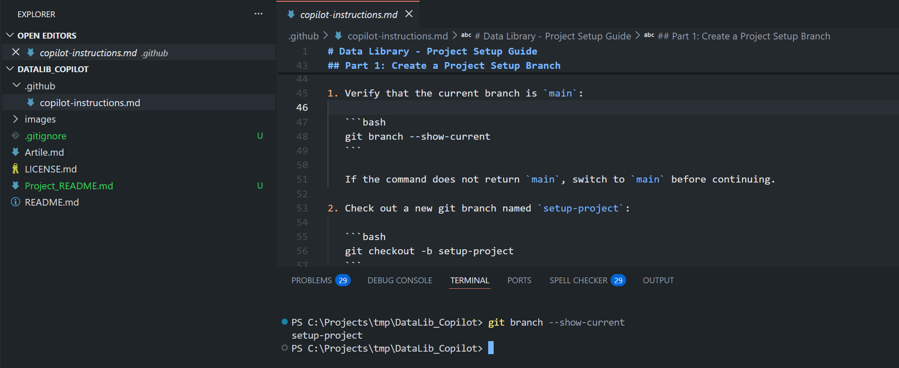

Please note that if you are creating a development project *from scratch*, you can modify a `.github/copilot-instructions.md` file to initiate a main branch in this step.

That’s all I have to say about the project git first set up.

### Part 2: Set Up the Python Virtual Environment

Now we come to a very important step of every Python projects — setting up a Python virtual environment and dependencies. A virtual environment keeps the project's dependencies isolated from your system Python, so installing or upgrading packages here will not affect other projects on your machine.

This guide demonstrates with the built-in [venv](https://docs.python.org/3/library/venv.html) module, but you can adapt the instructions in `.github/copilot-instructions.md` file to use [Anaconda](https://www.anaconda.com/)/[Miniconda](https://www.anaconda.com/docs/getting-started/miniconda/main), [virtualenv](https://virtualenv.pypa.io/en/latest/), [Pipenv](https://pipenv.pypa.io/en/latest/), or [Poetry](https://python-poetry.org/) depending on your team's preference.

Once the virtual environment is created and activated, the remaining steps in this part cover: upgrading `pip` to the latest version, installing the [LSEG Data Library for Python](https://pypi.org/project/lseg-data/) and [JupyterLab](https://pypi.org/project/jupyterlab/), saving the installed dependencies list and versions to `requirements.txt`, creating a [VS Code settings](https://code.visualstudio.com/docs/configure/settings) file, and finally creating an empty notebook file (without code yet) alongside its library configuration file.


````markdown
## Part 2: Set Up the Python Virtual Environment

1. Create a virtual environment named `.venv` inside the workspace root:

   ```bash
   python -m venv .venv
   ```

   This must create `.venv` at the workspace root.

2. Activate the environment:

   - **Windows (PowerShell):**
     ```powershell
     .\.venv\Scripts\Activate.ps1
     ```
   - **Windows (CMD):**
     ```cmd
     .venv\Scripts\activate.bat
     ```
   - **macOS / Linux:**
     ```bash
     source .venv/bin/activate
     ```

3. Update pip to the latest version:

   - **Windows (PowerShell/CMD):**
     ```powershell
     python -m pip install --trusted-host pypi.python.org --trusted-host files.pythonhosted.org --trusted-host pypi.org --no-cache-dir --upgrade pip
     ```
   - **macOS:**
     ```bash
     python3 -m pip install --trusted-host pypi.python.org --trusted-host files.pythonhosted.org --trusted-host pypi.org --no-cache-dir --upgrade pip
     ```

4. Install the required packages:

   - **Windows (PowerShell/CMD):**
     ```powershell
     python -m pip install --trusted-host pypi.python.org --trusted-host files.pythonhosted.org --trusted-host pypi.org --no-cache-dir lseg-data jupyterlab
     ```
   - **macOS:**
     ```bash
     python3 -m pip install --trusted-host pypi.python.org --trusted-host files.pythonhosted.org --trusted-host pypi.org --no-cache-dir lseg-data jupyterlab
     ```

5. Save the installed dependencies to `requirements.txt`:

   - **Windows (PowerShell/CMD):**
     ```powershell
     python -m pip freeze > requirements.txt
     ```
   - **macOS:**
     ```bash
     python3 -m pip freeze > requirements.txt
     ```

6. Create `.vscode/settings.json` with the following content:

   ```json
   {
     "git.ignoreLimitWarning": true
   }
   ```

7. Create the following file and folder structure under the project root:

   ```
   notebook/
   ├── ld_notebook.ipynb
   └── lseg-data.config.json
   ```

8. Create `lseg-data.config.json` inside `notebook` with the following content:

   ```json
   {
     "logs": {
       "level": "debug",
       "transports": {
         "console": {
           "enabled": false
         },
         "file": {
           "enabled": false,
           "name": "lseg-data-lib.log"
         }
       }
     }
   }
   ```
````

You may notice that I intentionally write each instruction with the exact command to run like `git checkout -b setup-project`, `python -m venv .venv`, `python -m pip freeze > requirements.txt`, and so on. This level of detail is deliberate. When Copilot has a precise command to follow, it can execute the step reliably and produce a consistent result every time.

I learned this the hard way. Early on, I tried writing the instructions in a much shorter form, like this:

```txt
1. Create a Python venv name .venv
2. Activate .venv
3. Update pip
4. Install lseg-data and jupyterlab 
```

The results were unreliable. Copilot would sometimes interpret the steps differently, create the virtual environment in the wrong location, use incorrect command syntax for the operating system, or skip steps entirely. The environment it produced was inconsistent and sometimes did not work at all.

After asking Copilot to review the instructions and suggest improvements, the feedback was clear: vague, high-level steps are not enough. Copilot needs each step to include the exact command to run, the expected output or file location, and any platform-specific variations. The more detail you provide, the more reliably Copilot can follow and reproduce the setup across different machines and environments.

This is the key lesson when writing a `copilot-instructions.md` file — treat it less like a quick checklist and more like a precise runbook where nothing is left to interpretation.

Please note that the `Part 2`'s steps are based on the Data Library 's Desktop Session in mind. If you are using the Platform Session (whether Data Platform or Deployed RTDS), please change the `lseg-data.config.json` template based on your connection. See [Data Library Quickstart](https://developers.lseg.com/en/api-catalog/lseg-data-platform/lseg-data-library-for-python/quick-start) page for more detail.

 - **Note**: **Do not** input your credential into a `copilot-instructions.md` file.

You get the following files and `.venv` virtual environment (which is grey out because the folder is listed in a `.gitignore` file). The `ld_notebook.ipynb` is empty because we did not give instructions to add anything to it yet.

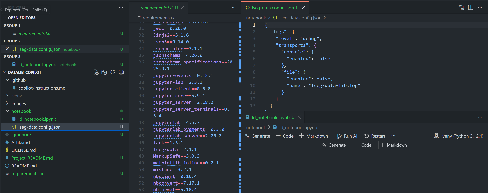

That covers the environment and project folder set up.

### Part 3: Notebook Code

Moving on to the Jupyter notebook `ld_notebook.ipynb` file. This step add some basic Data Library for Python code for verification purpose.

````markdown
## Part 3: Notebook Code

Open `notebook/ld_notebook.ipynb` in JupyterLab and run the following cells in order.

1. **Import the library:**

   ```python
   import lseg.data as ld
   ```

2. **Open a session (connects to LSEG Workspace):**

   ```python
   ld.open_session()
   ```

3. **Retrieve market data** (BID/ASK for EUR and JPY):

   ```python
   ld.get_data(universe = ['/EUR=','/JPY='], fields = ['BID','ASK'])
   ```

4. Do not need to run the notebook cells. Developers can run them by themselves to verify the setup is working. 
````

Once this step is completed, you get a basic Jupyter notebook file with a simple Data Library code. You can configure your Workspace Desktop application or your Data Platform/Deployed RTDS setting, then run the notebook to verify your connection and permission.

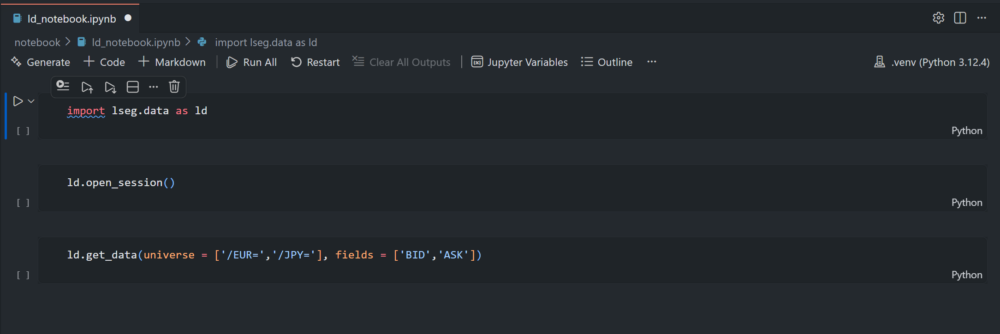

### Part 4: Finish a Project Setup Branch

Now we come to the last step, stage and commit every thing (that should be committed) to the Git *setup-project* branch. 

````markdown
## Part 4: Finish a Project Setup Branch

> **Prerequisite:** Part 3 must be completed by adding the required notebook cells to `ld_notebook.ipynb`. Running the notebook cells and saving outputs is optional and can be done later by developers.

1. Ensure that the git branch is `setup-project`:

   ```bash
   git branch --show-current
   ```

   If the command does not return `setup-project`, switch to `setup-project` before continuing.

2. Review the changes in the `setup-project` branch to confirm that all expected files are created and updated:

   ```bash
   git status
   git diff
   ```  

3. Stage all files and create a commit on `setup-project`:

   ```bash
   git add .
   git commit -m "setup: initial project structure with notebook and dependencies"
   ```
````

The **prerequisite** section above simply means the notebook code from Part 3 must already be in place before you commit. Running the cells and saving their outputs is not required at this stage — developers can do that on their own once the setup is complete.

```markdown
> **Prerequisite:** Part 3 must be completed by adding the required notebook cells to `ld_notebook.ipynb`. Running the notebook cells and saving outputs is optional and can be done later by developers.
```

The overall process of the part 4 section is clear, check if the current git branch is *setup-project*, then stages all files and make a commit.

The final project structure is as follows:

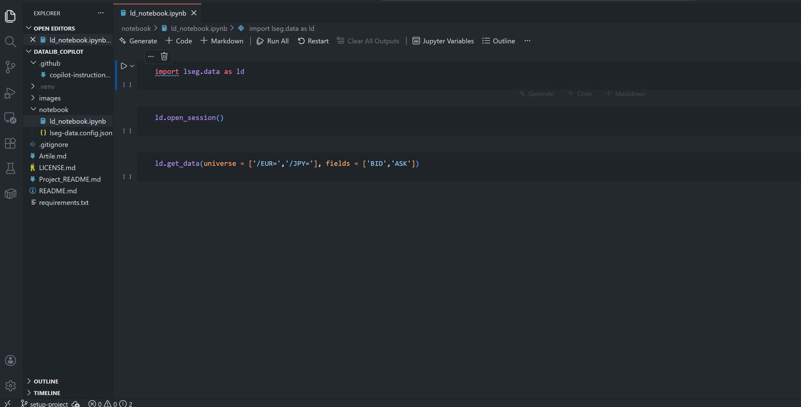

Let’s leave a `copilot-instructions.md` file there.

## Running the copilot-instructions.md file

Now, what about how to use this file. A [`.github/copilot-instructions.md`](./.github/copilot-instructions.md) file enables both GitHub Copilot Chat (VS Code extension) and Copilot CLI to automatically set up your entire project.
- **Note**: The given `.github/copilot-instructions.md` file set up the project for the **Desktop Session** by default.

To run this file, firstly open the project folder in a terminal or VS Code ([PowerShell](https://github.com/powershell/powershell) is preferred on Windows).

```bash
cd path\to\project_folder
```

Next, if you are using the **Platform Session** or **Deployed ADS** connection type, update the `lseg-data.config.json` file template content in the **Part 1** section of `.github/copilot-instructions.md` file to match your connection type (see the [Data Library Quickstart](https://developers.lseg.com/en/api-catalog/lseg-data-platform/lseg-data-library-for-python/quick-start#) page). **Please do not input your credential to the `.github/copilot-instructions.md` file**.

Then **start GitHub Copilot CLI** in the project directory (*using Powershell is recommended*) or **Open GitHub Copilot Chat** session.
   
GitHub Copilot Chat example.


Copilot CLI example.


You can select a Copilot model that suits your need. Please note that a `.github/copilot-instructions.md` file were tested on Windows with the following Copilot models 

- **Claude Sonnet 4.6**
- **Claude Opus 4.6**
- **GPT-5.4**
- **GPT-5.3-Codex**

If you use a different model, review and revise `.github/copilot-instructions.md` file with your selected model *and your review*, then retest the instructions until it satisfies your requirements before proceed the next step.

GitHub Copilot Chat example


Copilot CLI examples


Next, run the following command on the copilot

```bash
run all tasks in my copilot-instructions.md file
```

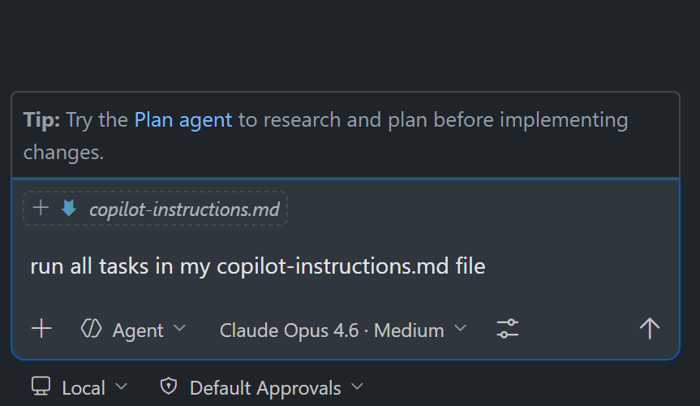

Please review each Copilot request step **with caution**. Different models and run times may prompt you for request messages differently — click Approve/Allow only when you are satisfied the action is appropriate to proceed.

GitHub Copilot Chat example

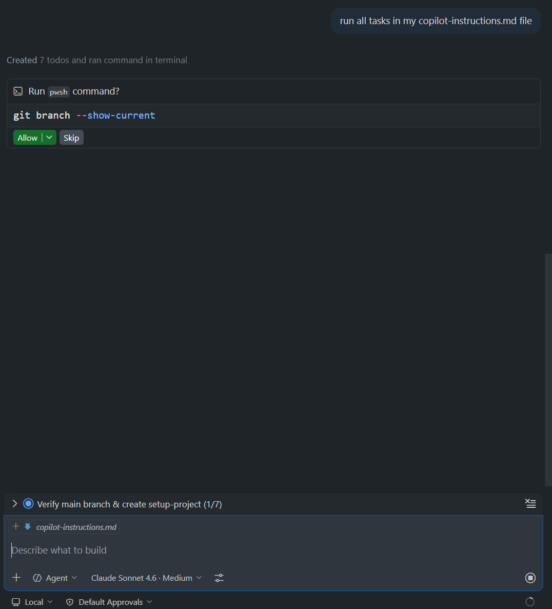

Copilot CLI example

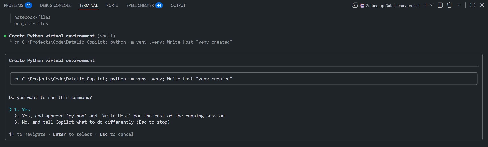

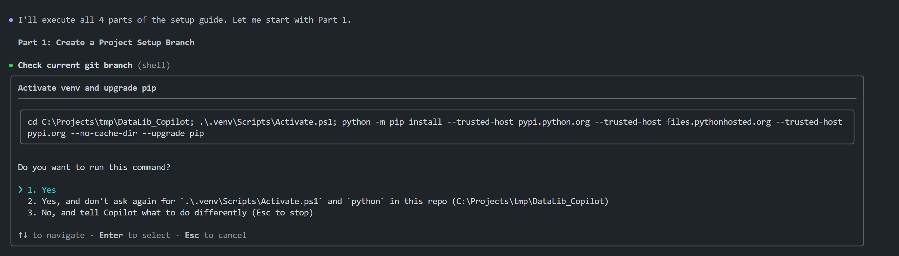

Please note that sometimes Copilot may skip steps or become idle while running tasks; if this happens, send another prompt to make it continues tasks.

GitHub Copilot Chat example


   
Copilot CLI example

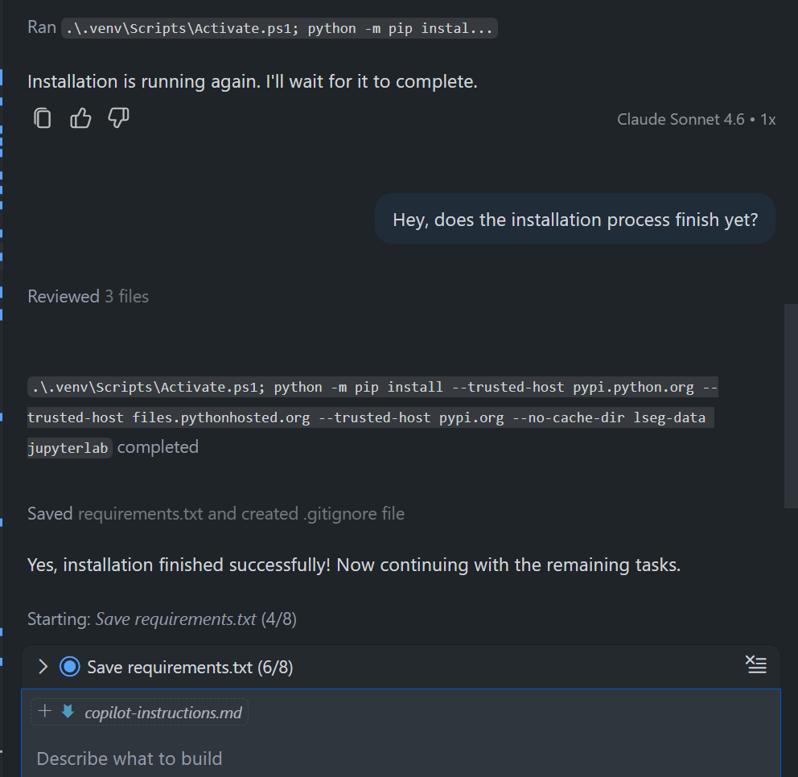

Once the process is completed, you see the following kind of message from Copilot that it has finished all tasks.

GitHub Copilot Chat example

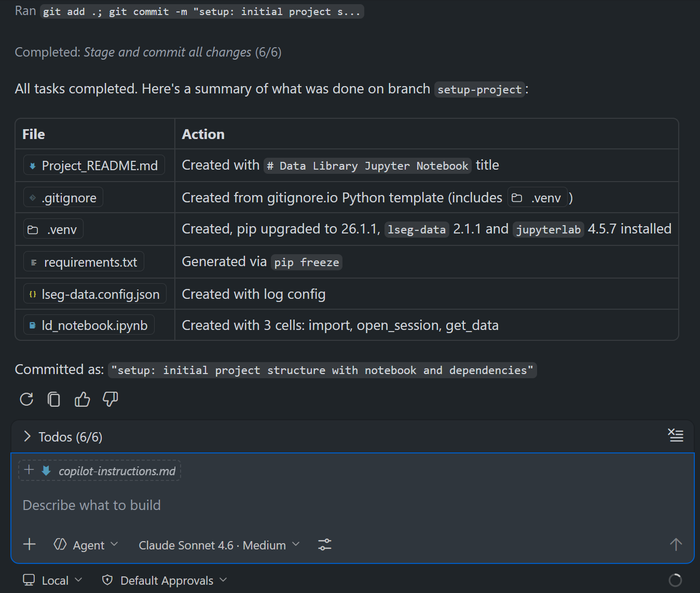

Copilot CLI example
   
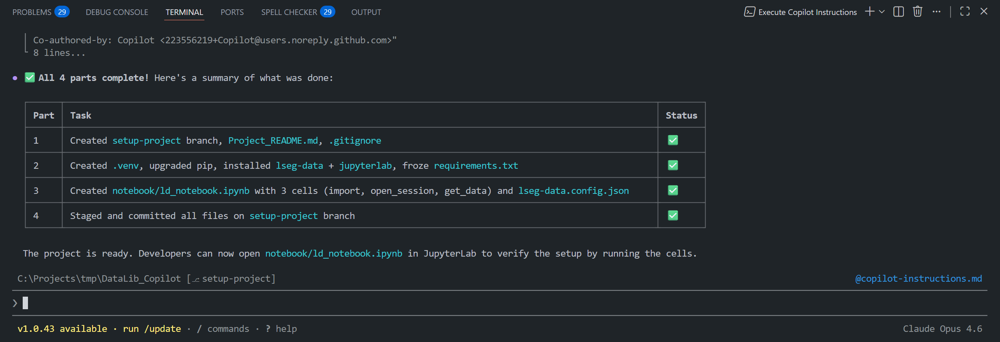

You will get a ready-to-use Data Library Jupyter Notebook application development project with the structure as shown on **Part 4: Finish a Project Setup Branch** section.

That covers how to run a `copilot-instructions.md` file.

## Post-Setup Guideline

After the automated setup finishes, review these project-specific items before you publish or reuse the repository:

First, start and login the Workspace Desktop application, or configure the `notebook\lseg-data.config.json` file with your Data Platform/Deployed RTDS credential and information. Then run the notebook `ld_notebook.ipynb` file to verify your connection and permission.

Secondly, update the copyright owner and year content of `LICENSE.md` file to match your organization.

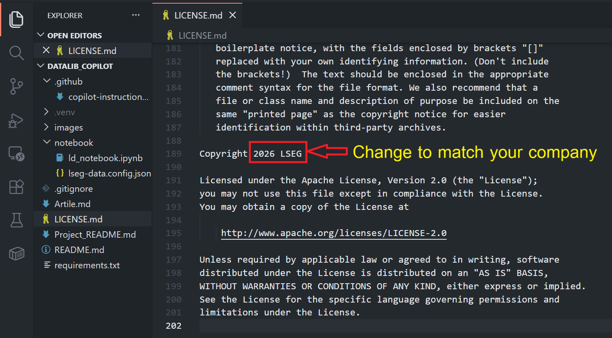

Thirdly, update the `README.md` file, `Project_README.md` file , `image` folder, and manage the Git branch to match your preference, then start coding!!!.


