# Automated LSEG Data Library Jupyter Notebook Setup with GitHub Copilot

- Version: 1.0
- Last update: Apr 2026
- Environment: Python + Git + Copilot

## Overview

Setting up a new Python data project — creating virtual environments, installing packages, configuring library credentials, and scaffolding notebooks — is a repetitive process that every developer has to go through, often from scratch each time. This project shows how that entire workflow can be driven by a single AI prompt, with no manual steps required.

This project demonstrates how to use a `copilot-instructions.md` file to automatically set up a complete [LSEG Data Library for Python](https://developers.lseg.com/en/api-catalog/lseg-data-platform/lseg-data-library-for-python) Jupyter Notebook environment using [GitHub Copilot](https://github.com/features/copilot). The setup is triggered through either the [GitHub Copilot Chat extension for VS Code](https://marketplace.visualstudio.com/items?itemName=GitHub.copilot-chat) or the [Copilot CLI](https://github.com/features/copilot/cli) — whichever fits your preferred workflow.

The `.github/copilot-instructions.md` file at the heart of this project acts as a structured, step-by-step runbook that Copilot reads and executes. It instructs Copilot to create a Python virtual environment, upgrade pip, install the required packages (`lseg-data` and `jupyterlab`), generate a `requirements.txt`, create and populate a Jupyter notebook with working LSEG Data Library code, write the library configuration file, and finally commit everything to a new Git branch — all from a single prompt.

The goal is to demonstrate that GitHub Copilot's agentic capabilities extend well beyond code completion. With the right instructions, Copilot can reliably automate the full environment lifecycle, making it straightforward for any team member — regardless of their familiarity with the LSEG Data Library — to get a working development environment up and running in minutes.

### Disclaimer

This project and the `.github/copilot-instructions.md` file were tested on Windows with the following Copilot models 

- **Claude Sonnet 4.6 and Opus 4.6**: Both Chat Extensions and Copilot CLI
- **GPT-5.4**: Both Chat Extensions and Copilot CLI
- **Auto Model selection**: Both Chat Extensions and Copilot CLI

If you use a different model, ask it to review and revise `.github/copilot-instructions.md` file *with your review*, then retest the instructions until it satisfies your requirements.

--- 

## What is GitHub Copilot

[GitHub Copilot](https://github.com/features/copilot) is an AI coding assistant that helps you write code faster and with less effort. Then, you can focus more energy on problem solving and collaboration. It supports multiple AI models. The GitHub Copilot integrates with your favorite IDE such as [VS Code](https://code.visualstudio.com/), [MS Visual Studio](https://visualstudio.microsoft.com/), [JetBrains IDEs family](https://www.jetbrains.com/), [Apple XCode](https://developer.apple.com/xcode/), [Eclipse](https://eclipseide.org/), etc. for the seamless workflow.

I am demonstrating with the VS Code and the [GitHub Copilot Chat extension for VS Code](https://marketplace.visualstudio.com/items?itemName=GitHub.copilot-chat) extension.

---

## What is Copilot CLI

[Copilot CLI](https://github.com/features/copilot/cli) is a command line interface tool allows you to use the Copilot directly from your terminal. You can use it to answer questions, write and debug code, and interact with GitHub.com. For example, you can ask Copilot to make some changes to a project and create a pull request.

GitHub Copilot CLI gives you quick access to a powerful AI agent, without having to leave your terminal. It can help you complete tasks more quickly by working on your behalf, and you can work iteratively with GitHub Copilot CLI to build the code you need.

---

## Prerequisites

Before you begin, ensure the following are installed and available on your `PATH`:

- **Python 3.11 or higher** — [python.org/downloads](https://www.python.org/downloads/)
- **Git** — [git-scm.com](https://git-scm.com/)
- [**Copilot CLI**](https://github.com/features/copilot/cli) or [**GitHub Copilot Chat extension for VS Code**](https://code.visualstudio.com/docs/copilot/overview) — with access to this repository
- **Network access** to PyPI (or a trusted mirror)

### Connection Type Requirement

- If you are using the **Desktop Session**: The [LSEG Workspace Desktop application](https://www.lseg.com/en/data-analytics/products/workspace) is required.
- If you are using the **Platform Session**: The [LSEG Data Platform](https://developers.lseg.com/en/api-catalog/refinitiv-data-platform/refinitiv-data-platform-apis) account and permission is required.
- If you are using the **Streaming services within a deployed ADS**: The local deployed ADS server Hostname/IP Address, WebSocket Port, DACS username (if any) is required. Please contact your Market Data Team.

You can find more regarding each connection type setting in the [Data Library Quickstart](https://developers.lseg.com/en/api-catalog/lseg-data-platform/lseg-data-library-for-python/quick-start#) page.

---

## Setting Up with GitHub Copilot

This project includes a [`.github/copilot-instructions.md`](./.github/copilot-instructions.md) file for  both GitHub Copilot Chat extension for VS Code and Copilot CLI that tells Copilot how to set up the entire project automatically.

The given `.github/copilot-instructions.md` file set up the project for the **Desktop Session** by default.

### Steps

1. Open the project folder in a terminal or VS Code:

   ```powershell
   cd path\to\DataLib_Copilot
   ```

2. If you are using the **Platform Session** or **Deployed ADS** connection type, update the `lseg-data.config.json` content in the **Part 1** section of `.github/copilot-instructions.md` to match your connection type (see the [What If I Am Using the Platform Session Or Deployed ADS?](#what-if-i-am-using-the-platform-session-or-deployed-ads) section below).

3. **Start GitHub Copilot CLI** in the project directory (*using Powershell is recommended*) or **Open GitHub Copilot Chat** session.
   
   *GitHub Copilot Chat* example.

   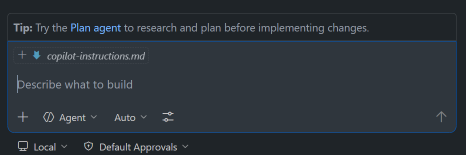

   *Copilot CLI* example.

   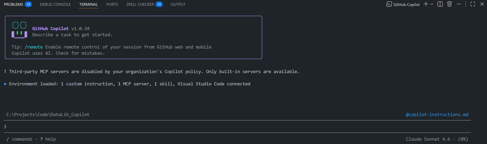

4. Select a Copilot model that suits your need.

   *GitHub Copilot Chat* example

   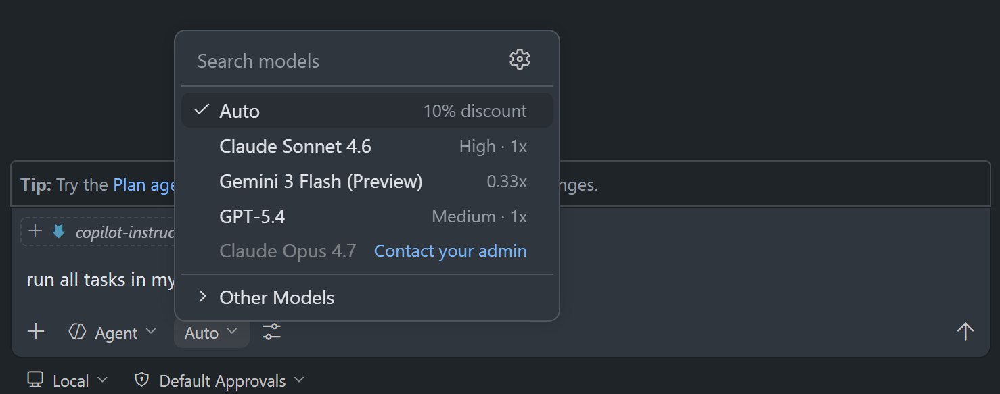

   *Copilot CLI* examples

   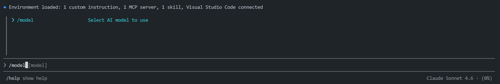

   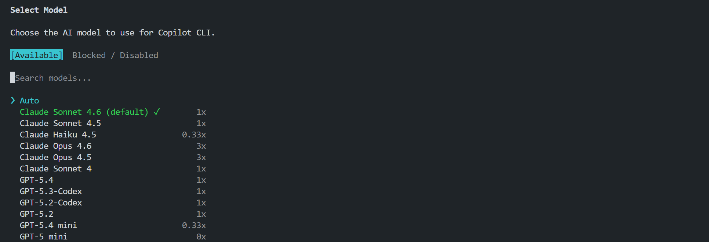

5. Run the setup prompt:

   ```
   run all tasks in my copilot-instructions.md file
   ```

   *GitHub Copilot Chat* examples

   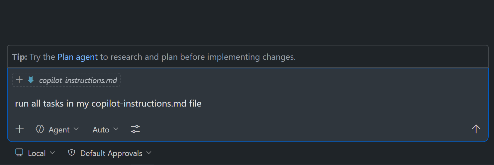

6. Review each Copilot request step **with caution**. Different models and run times may prompt you for request messages differently — click Approve/Allow only when you are satisfied the action is appropriate to proceed.

   *GitHub Copilot Chat* example

   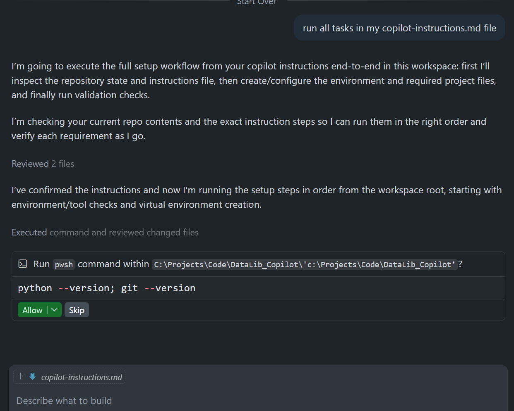

   *Copilot CLI* example

   

    Copilot then performs the following tasks based on the `.github\copilot-instructions.md` markdown file:
    - Create a `.venv` Python virtual environment
    - Upgrade `pip` and install `lseg-data` + `jupyterlab`
    - Generate `requirements.txt`
    - Create `notebook/ld_notebook.ipynb` and `notebook/lseg-data.config.json`
    - Add `README.md`, and `.gitignore` files
    - Create a new Git branch named `setup-project`, then stage and commit all files to it

7. Once the process is completed, you see the following kind of message from Copilot that it has finished all tasks.

   *GitHub Copilot Chat* example

   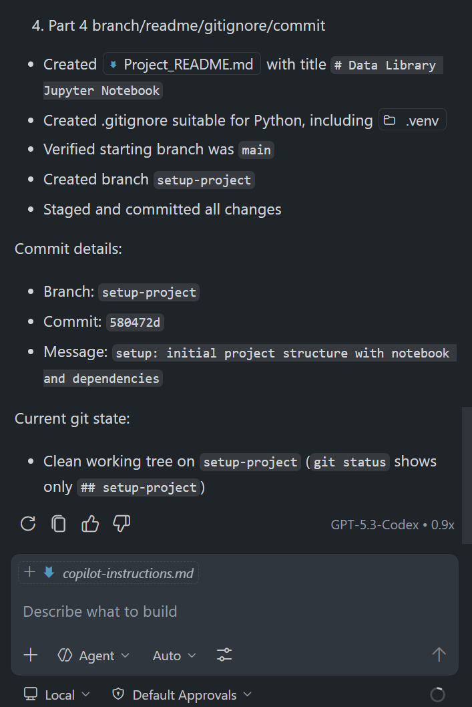

   *Copilot CLI* example
   
   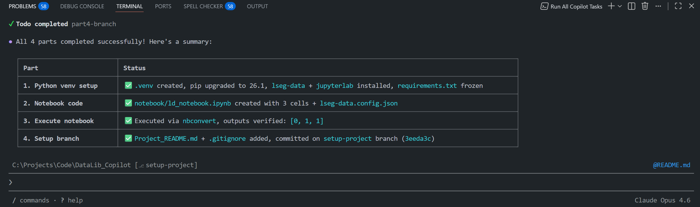

8. Please note that sometimes Copilot may skip steps or become idle while running tasks; if this happens, send another prompt to continue.

   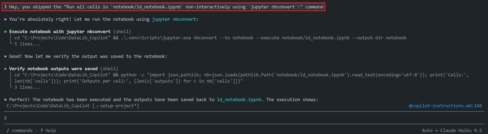

9. You see the following project structure when the process is finished.

   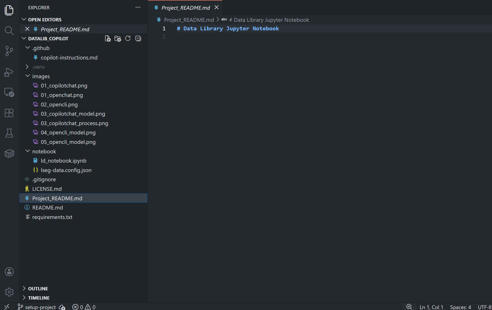

   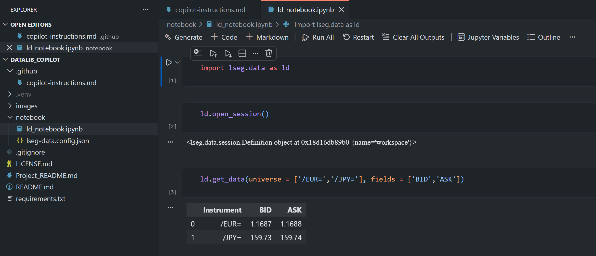

   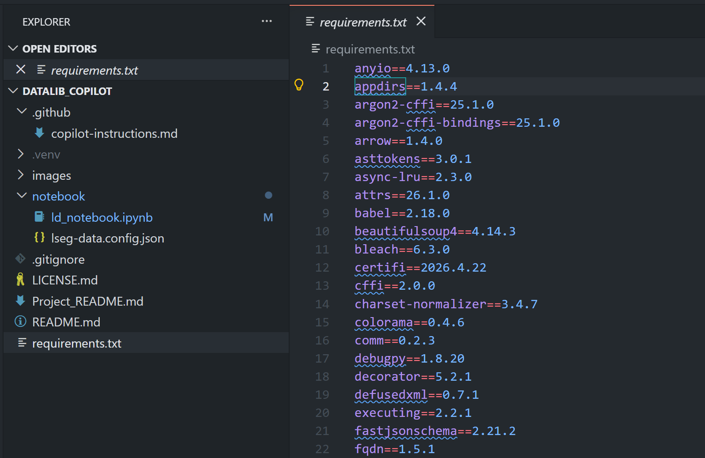

---

## Post-Setup Guideline

After the automated setup finishes, review these project-specific items before you publish or reuse the repository:

1. Add the correct copyright owner and year to `LICENSE.md` if you want to include a project-specific notice.

  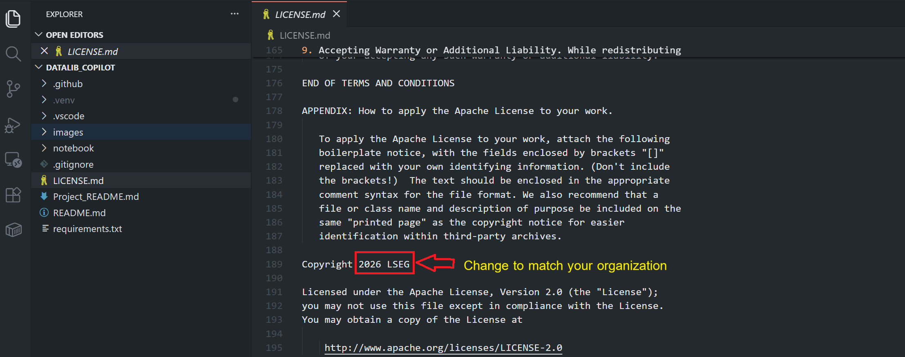


2. Update this `README.md` so the title, overview, setup notes, and session guidance match your actual project.
3. Update the `images` folder to match your project/repository images.
4. Mange the Git repository based on your preference (create new branch, etc.).
5. Start coding!!

---

## Project Structure

```
DataLib_Copilot/
├── .github/
│   └── copilot-instructions.md   # Copilot setup guide (for VS Code Copilot Chat and Copilot CLI)
├── .vscode/
│   └── settings.json             # VS Code
├── .venv/                        # Python virtual environment (git-ignored)
├── notebook/
│   ├── ld_notebook.ipynb         # Example Data Library for Python JupyterLab notebook
│   └── lseg-data.config.json     # LSEG Data Library configuration file
├── .gitignore
├── LICENSE.md                    # Apache 2.0
├── Project_README.md             # Example Project's README file
├── README.md                     # README for "this Repository"
├── images/                       # "this Repository" images folder
└── requirements.txt
```

---

## What If I Am Using the Platform Session Or Deployed ADS?

If you are using the **Platform Session**, you can configure a `notebook/lseg-data.config.json` based on the type of your connection type and update the `notebook/lseg-data.config.json` content in `.github\copilot-instructions.md` markdown file.

**Email-based or Machine-ID (GE-A-XXXXXXXX-X-XXXX)**

```json
{
  "logs": {
    "level": "info",
    "transports": {
      "console": {
        "enabled": false
      },
      "file": {
        "enabled": false,
        "name": "lseg-data-lib.log"
      }
    }
  },
  "sessions": {
    "default": "platform.ldp",
    "platform": {
      "ldp": {
        "app-key": "YOUR APP KEY GOES HERE!",
        "username": "YOUR LDP LOGIN OR MACHINE GOES HERE!",
        "password": "YOUR LDP PASSWORD GOES HERE!",
        "signon_control": true
      }
    }
  }
}
```

**Service Account (GE-XXXXXXXXXXXX)**

```json
{
  "logs": {
    "level": "info",
    "transports": {
      "console": {
        "enabled": false
      },
      "file": {
        "enabled": false,
        "name": "lseg-data-lib.log"
      }
    }
  },
  "sessions": {
    "default": "platform.ldpv2",
    "platform": {
      "ldpv2": {
        "client_id": "Service-ID (Client ID V2)",
        "client_secret": "Client Secret",
        "signon_control": true,
        "app-key": ""
      }
    }
  }
}

```

**Deployed ADS**

```json
{
  "logs": {
    "level": "info",
    "transports": {
      "console": {
        "enabled": false
      },
      "file": {
        "enabled": false,
        "name": "lseg-data-lib.log"
      }
    }
  },
  "sessions": {
    "default": "platform.deployed",
    "platform": {
      "deployed": {
        "app-key": "YOUR APP KEY GOES HERE!",
        "realtime-distribution-system": {
          "url": "YOUR DEPLOYED HOST:PORT GOES HERE!",
          "dacs": {
            "username": "YOUR DACS ID GOES HERE!",
            "application-id": 256,
            "position": ""
          }
        }
      }
    }
  }
}

```

You can find more regarding each connection type setting in the [Data Library Quickstart](https://developers.lseg.com/en/api-catalog/lseg-data-platform/lseg-data-library-for-python/quick-start#) page.

Then update **Part 3** of the `.github\copilot-instructions.md` file on this part to match your Session/Connection Type.

```markdown
> **Assuming the LSEG Workspace is running and signed in, run the following commands from the workspace root to execute the notebook non-interactively and save outputs back into `ld_notebook.ipynb`.**
```
---

## License

The  project is licensed under the [Apache License 2.0](https://www.apache.org/licenses/LICENSE-2.0).

---

## Conclusion

This project demonstrates how a well-crafted `copilot-instructions.md` file can turn GitHub Copilot into a reliable project setup assistant — capable of automating repetitive environment configuration step-by-step tasks from a single natural language prompt.

### Key Takeaways

- **Repeatable setup**: The `.github/copilot-instructions.md` file acts as a machine-readable runbook. Any developers with access to the repository and GitHub Copilot can reproduce the full environment — virtual environment, dependencies, notebook, and configuration files — without reading lengthy documentation or running commands manually.

- **Model flexibility**: The same instruction file works across multiple Copilot models (Claude Sonnet 4.6, GPT-5.4, and Auto model selection), both in the VS Code Copilot Chat extension and Copilot CLI. This means the workflow is not locked to a single AI provider.

- **Reduced onboarding friction**: New team members can get a working LSEG Data Library Jupyter Notebook environment running in minutes, regardless of their familiarity with the library or its configuration requirements.

- **Customizable for different connection types**: The instruction file is straightforward to adapt — updating the `lseg-data.config.json` block is all that is needed to switch between Desktop Session, Platform Session, and Deployed ADS workflows.

- **Version-controlled intent**: Storing setup instructions alongside the code in `.github/copilot-instructions.md` keeps the "how to set up this project" knowledge inside the repository itself, where it is versioned, reviewable, and improvable like any other source file.

### When to Use This Approach

This pattern is most valuable when:
- A project requires a non-trivial environment setup (specific packages, configuration files, directory structure).
- The setup needs to be reproducible across different machines or team members.
- You want to reduce reliance on external wikis or onboarding documents that can drift out of sync with the codebase.

By combining GitHub Copilot's agentic capabilities with a structured instruction file, this project shows that AI-assisted automation does not have to be limited to writing application code — it can manage the entire developer environment lifecycle.

---

## Reference

You can find more detail regarding the Data Library and GitHub Copilot from the following resources:

- [LSEG Data Library for Python](https://developers.lseg.com/en/api-catalog/lseg-data-platform/lseg-data-library-for-python) on the [LSEG Developer Community](https://developers.lseg.com/) website.
- [Data Library for Python - Reference Guide](https://developers.lseg.com/en/api-catalog/lseg-data-platform/lseg-data-library-for-python/documentation#reference-guide)
- [The Data Library for Python  - Quick Reference Guide (Access layer)](https://developers.lseg.com/en/article-catalog/article/the-data-library-for-python-quick-reference-guide-access-layer) article.
- [Essential Guide to the Data Libraries - Generations of Python library (EDAPI, RDP, RD, LD)](https://developers.lseg.com/en/article-catalog/article/essential-guide-to-the-data-libraries) article.
- [Upgrade from using Eikon Data API to the Data library](https://developers.lseg.com/en/article-catalog/article/Upgrade-from-using-Eikon-Data-API-to-the-Data-library) article.
- [Data Library for Python Examples on GitHub](https://github.com/LSEG-API-Samples/Example.DataLibrary.Python) repository.
- [GitHub Copilot documentation](https://docs.github.com/en/copilot).
- [Adding custom instructions for GitHub Copilot CLI](https://docs.github.com/en/copilot/how-tos/copilot-cli/customize-copilot/add-custom-instructions).
- [Adding repository custom instructions for GitHub Copilot](https://docs.github.com/en/copilot/how-tos/configure-custom-instructions/add-repository-instructions?tool=vscode).

For any question related to this example or Data Library, please use the Developers Community [Q&A Forum](https://community.developers.refinitiv.com).
